## Getting Started - Craft SDK application development using .NET (C#)  

#### 1. Requirements

Logitech Craft Keyboard

Logitech Options 6.80 and above

#### 2. Setup
Install Visual Studio IDE from (https://www.visualstudio.com/)

Open project WinFormsCrownSample.sln.

Install Newtonsoft.json from Visual Studio by selecting Tools > NuGet Package Manager > Manage NuGet Packages for Solution... 

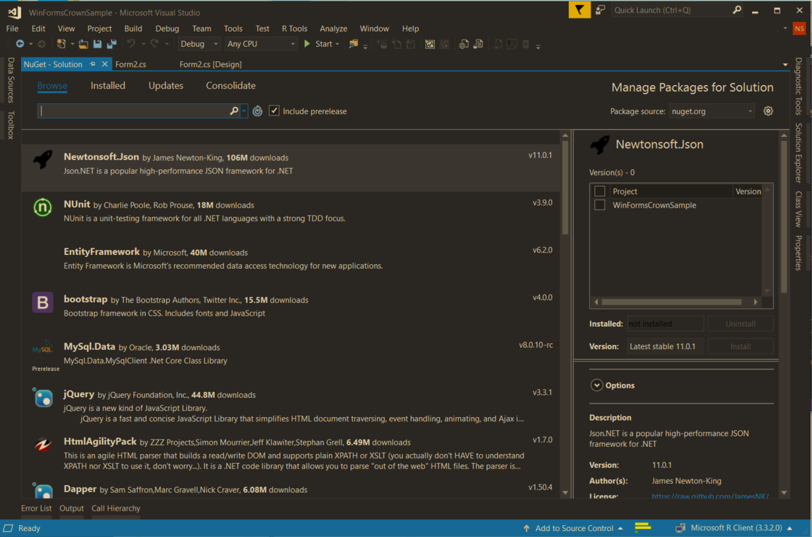

Install WebSocketSharp from Visual Studio by selecting Tools > NuGet Package Manager > Manage NuGet Packages for Solution...

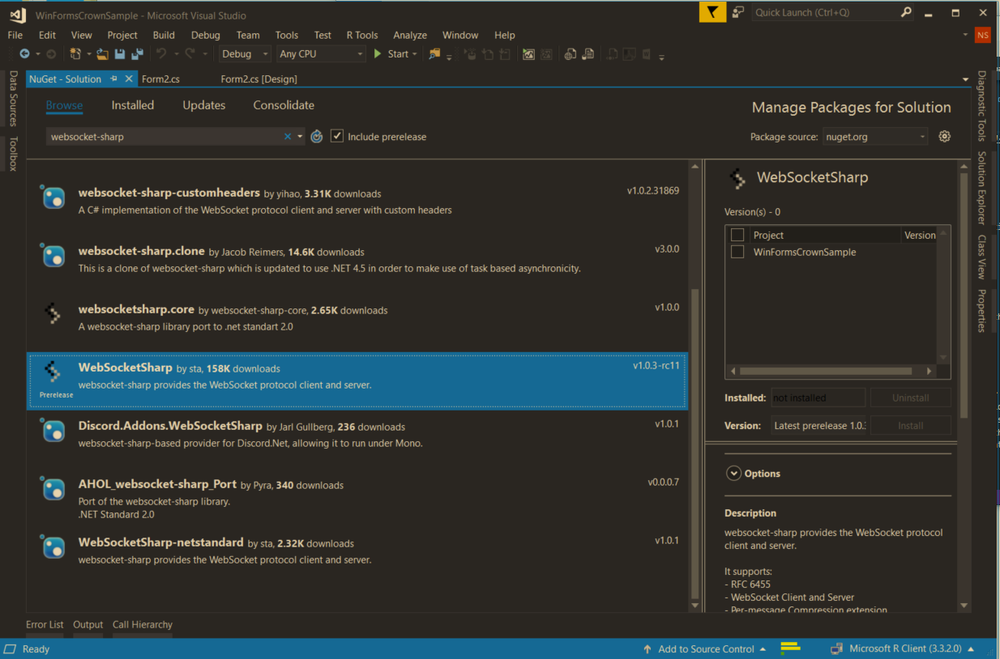

#### 3. Manifest file

Create a folder under ProgramData/Logishrd/LogiOptionsPlugins. Copy the sample manifest folder (d510af8d-360f-4f3d-9216-20cd4f20f664) into the LogiOptionsPlugins folder.


Build and run WinFormsCrownSample.exe from Visual Studio or from command line.

#### 4. Enable Developer Mode
Start Logitech Options and click Craft Advanced Keboard image

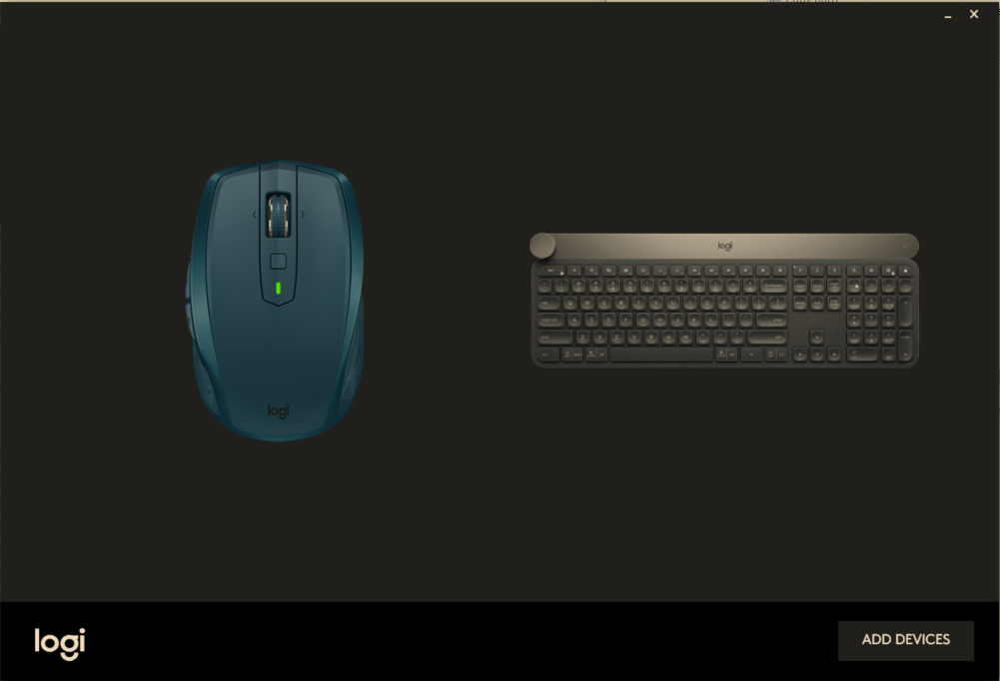

Click MORE SETTINGS

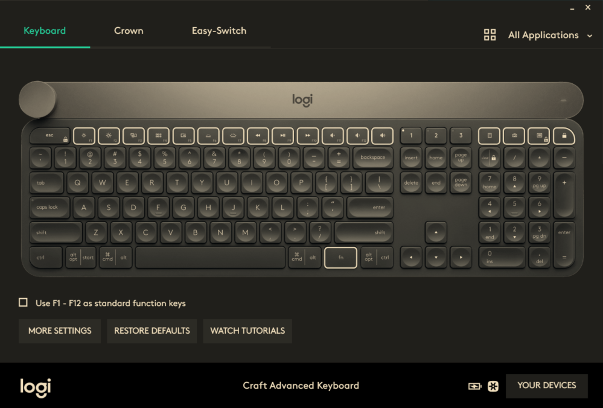

Click Software tab and click ENABLE button from Developer Mode panel.

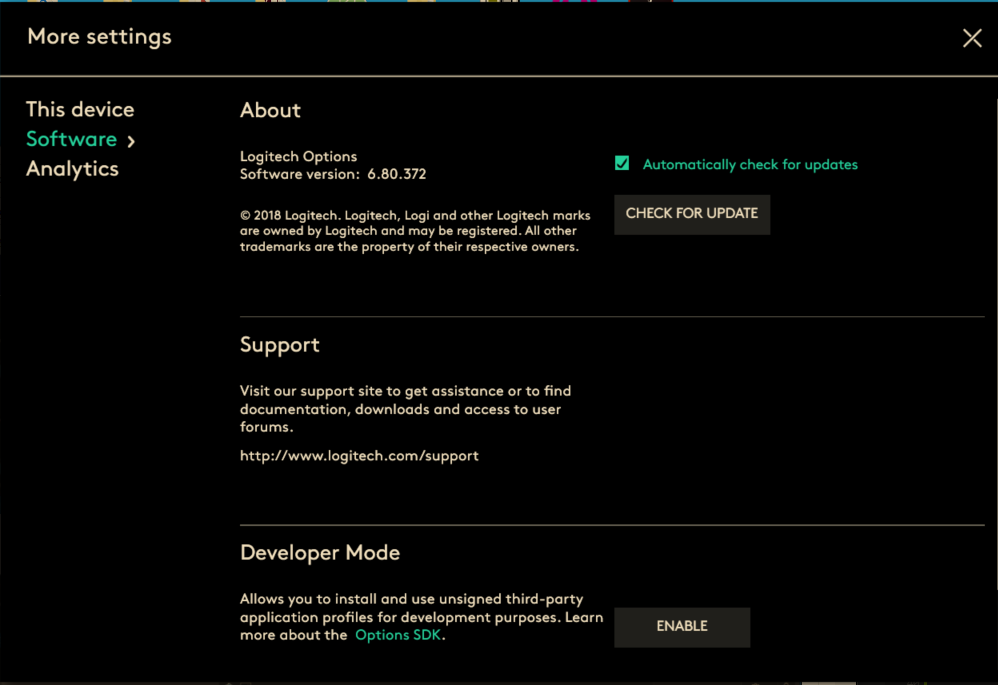


Next, Click "All Applications" You will see list of application detected by the Logitech Options.

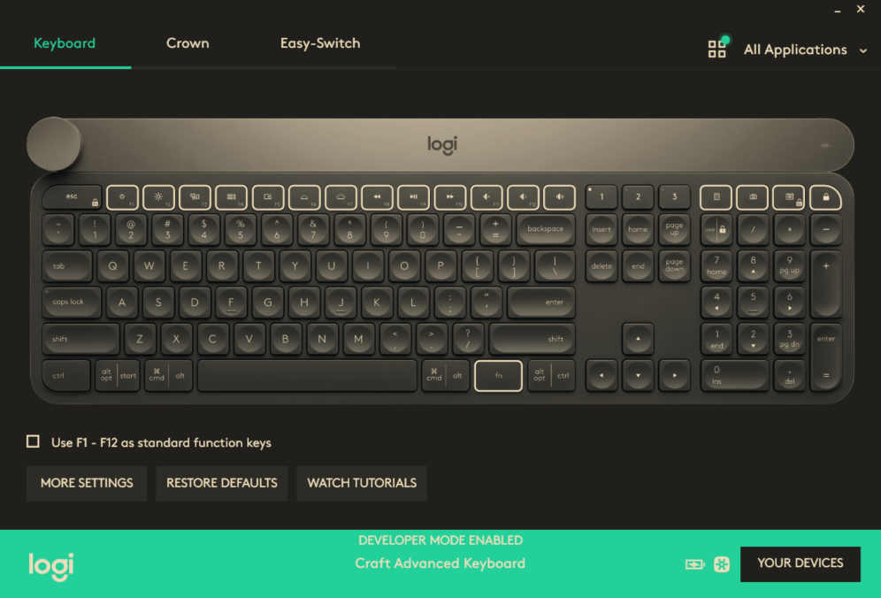

Click "Add application"

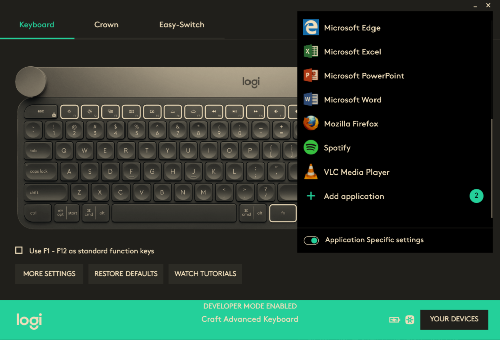

Select your sample application and click "INSTALL PROFILES".

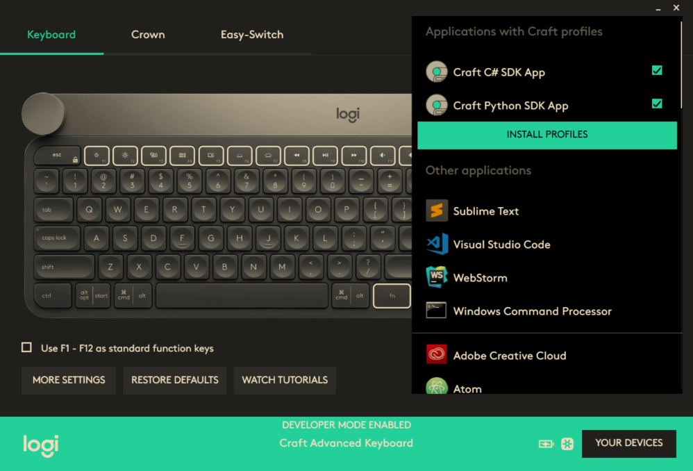

Confirm and click "INSTALL PROFILES"

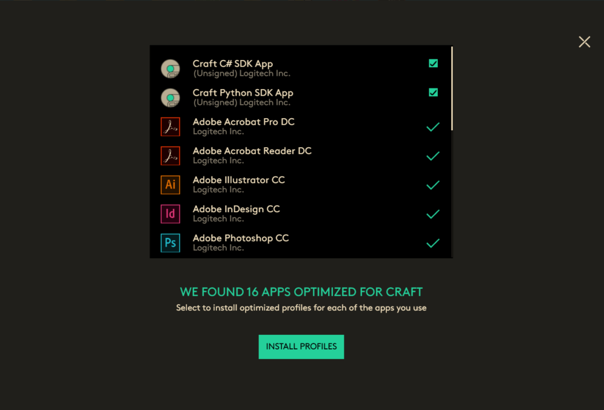

Click CONTINUE button

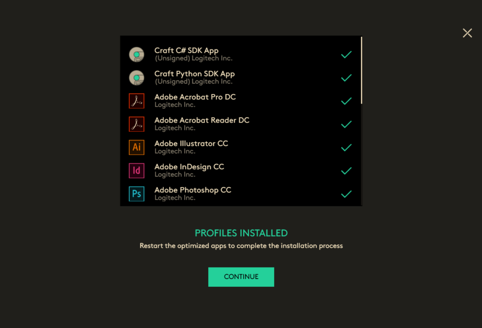

Confirm that profile has been enabled for you sample applicaiton.

 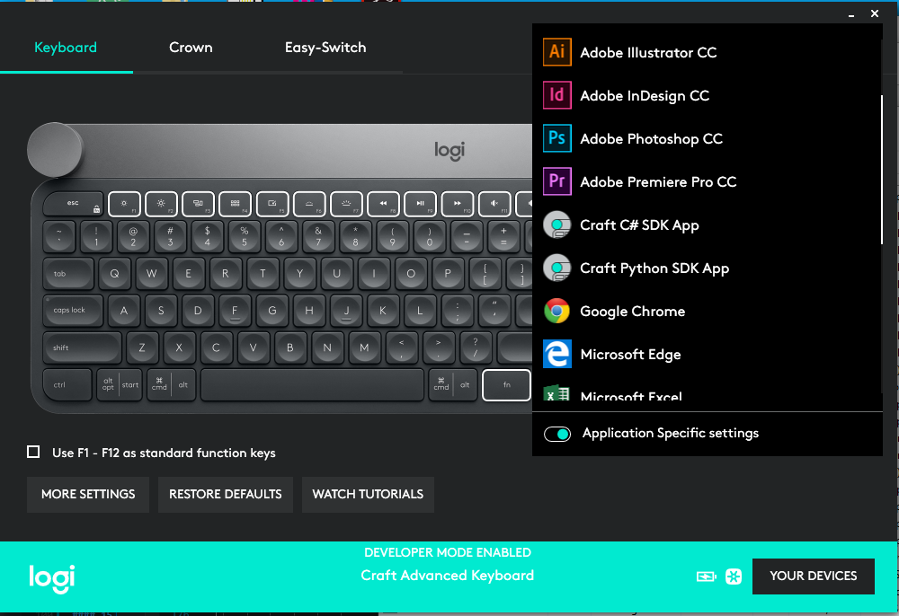

Now switch to your sample Craft application and use crown to adjust your app's controls.
#### 4. App Running

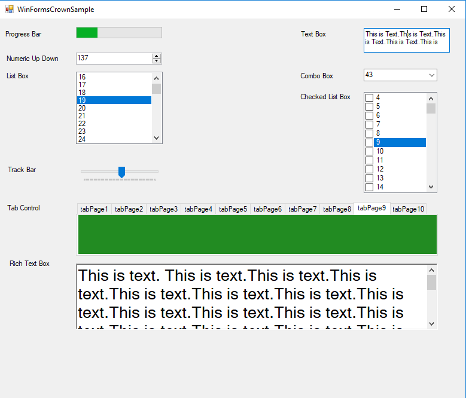

#### 5. Deployment 

If want to deploy your plugins to other Logitech Options Craft users, you will need to contact Logitech at craftSDK@logitech.com more information.


Below steps are for new manifest file creation

#### 6. GUID creation

Create a GUID (Globally Unique Identifier) using a online GUID generator. Create a folder in the same name as the GUID as shown below. And create 3 folders (Gallery, Languages and Manifest)


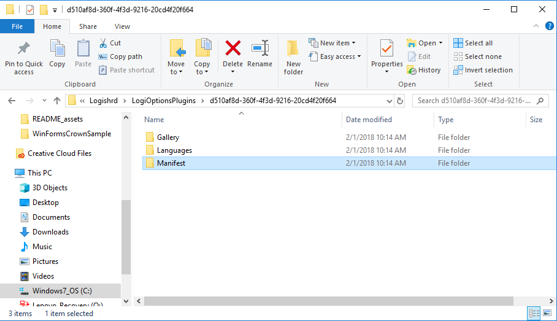

#### 7. Manifest folder

Create 2 files in the Manifest folder (defaults.json, tools.json)

defaults.json

```json
{
    "GUID": "d510af8d-360f-4f3d-9216-20cd4f20f664",
    "info": {
        "name": "Craft C# SDK App",
		"publisher": "Logitech Inc.",
        "version": "1.0",
        "win_name": "WinFormsCrownSample.exe",
		
        "mac_bundle": "",
        "mac_path": "",
        "mac_paths": [
            {
                "path": "",
                "mac_minimum_supported_version": "",
                "mac_maximum_supported_version": "",
                "name_suffix": ""
            },
            {
                "path": "",
                "comment": "",
                "mac_minimum_supported_version": "",
                "mac_maximum_supported_version": "",
                "name_suffix": ""
            }
        ],
        "win_minimum_supported_version": "0.0.0",
        "win_maximum_supported_version": "2017.0.1"
    },
    "crown": {
        "rotate": {
            "default_task": "changetoolvalue",
            "tasks": [
                "changetoolvalue"
            ],
            "short_list": [
                "changetoolvalue"
            ]
        },
        "press": {
            "default_task": "playpause",
            "tasks": [
                "playpause"
            ],
            "short_list": [
                "playpause"
            ]
        }
    }
}
```

Change the GUID key to the online generated value. Change the name, publisher, version and win_name as shown in the figure.

tools.json

```json
{
    "GUID": "d510af8d-360f-4f3d-9216-20cd4f20f664",
    "tools": [        
        {
            "name": "ProgressBar",
            "enabled": true,
            "tool_options": [
                {
                    "index": 0,
                    "name": "progressBar",
                    "image_file_path": "textSize.png",
                    "enabled": true,
                    "ratchet_enabled": false
                }
            ]
        },
		{
            "name": "NumericUpDown",
            "enabled": true,
            "tool_options": [
                {
                    "index": 0,
                    "name": "numericUpDown",
                    "image_file_path": "textSize.png",
                    "enabled": true,
                    "ratchet_enabled": false
                }
            ]
        },
		{
            "name": "ListBox",
            "enabled": true,
            "tool_options": [
                {
                    "index": 0,
                    "name": "listBox",
                    "image_file_path": "textSize.png",
                    "enabled": true,
                    "ratchet_enabled": false
                }
            ]
        },
```

Create a tools.json file and add the GUID in the top of the file as shown above. Add other information and name is the name of the control that craft need to control. image_file_path is the image file that is shown in the overlay. ratchet_enabled controls the ratchet or freewheel mode.

#### 8. Languages folder

 Create a file called en.json for english version. The LocalizedStrings contain the ID and value key. ID corresponds to the name in the tool_options in the tools.json.

```json
{
    "LocalizedStrings": [
        {
            "ID": "progressBar",
            "value": "Progress Bar"
        },
        {
            "ID": "numericUpDown",
            "value": "Numeric Up Down"
        },
        {
            "ID": "listBox",
            "value": "List Box"
        },
        {
            "ID": "comboBox",
            "value": "Combo Box"
        },
        {
            "ID": "checkedListBox",
            "value": "Checked List Box"
        },
        {
            "ID": "trackBar",
            "value": "Track Bar"
        },
        {
            "ID": "tabControl",
            "value": "Tab Control"
        },
        {
            "ID": "richTextBox",
            "value": "Rich Text Box"
        },
```

#### 9. Gallery folder

Create a Gallery folder and copy all the image files that are referenced in the tools.json.

 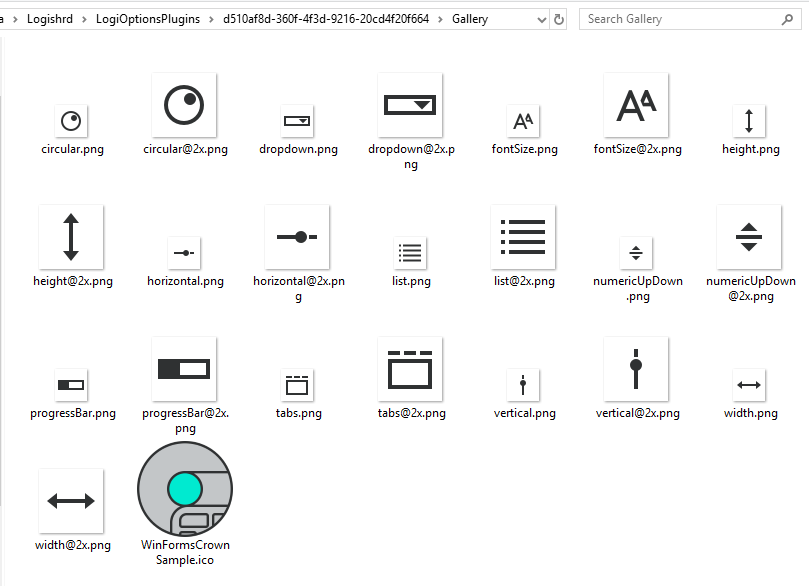

#### 10. Initialization
The init function connect with the Logi Options using websocket.

```csharp
public void init()
{
    try
    {
        // setup timers 
        SetupUIRefreshTimer();

        // setup connnection 
        connectWithManager();
    }
    catch (Exception ex)
    {
        string str = ex.Message;
    }

}
```

#### 11. Form Initialization

```csharp
public Form2()
{
    InitializeComponent();

    // start the connnection process 
    init();

    progressBar1.Maximum = 1000;
    progressBar1.Step = 1;
    progressBar1.Value = 1;

    numericUpDown1.Minimum = 0;
    numericUpDown1.Maximum = 1000;

    for (int i = 0; i < 1000; i++)
    {
        listBox1.Items.Add(i.ToString());
    }
    listBox1.SelectedIndex = 0;

    for (int i = 0; i < 1000; i++)
    {
        comboBox1.Items.Add(i.ToString());
    }
    comboBox1.SelectedIndex = 0;

    for (int i = 0; i < 1000; i++)
    {
        checkedListBox1.Items.Add(i.ToString());
    }
    checkedListBox1.SetItemChecked(0,true);

    trackBar1.Minimum = 0;
    trackBar1.Maximum = 100;
}

```
Above code intializes all the controls in the form to some default value.

#### 12. Registration

```csharp
public static void connectWithManager()
{
    try
    {
        client = new WebSocket(host);

        client.OnOpen += (ss, ee) =>
            openUI(string.Format("Connected to {0} successfully", host));
        client.OnError += (ss, ee) =>
            displayError("Error: " + ee.Message);

        client.OnMessage += (ss, ee) =>
            wrapperUpdateUI(ee.Data);

        client.OnClose += (ss, ee) =>
            closeConnection();

        client.Connect();

        // build the connection request packet 
        Process currentProcess = Process.GetCurrentProcess();
        CrownRegisterRootObject registerRootObject = new CrownRegisterRootObject();
        registerRootObject.message_type = "register";
        registerRootObject.plugin_guid = "d510af8d-360f-4f3d-9216-20cd4f20f664";
        registerRootObject.execName = "WinFormsCrownSample.exe";
        registerRootObject.PID = Convert.ToInt32(currentProcess.Id);
        string s = JsonConvert.SerializeObject(registerRootObject);


        // only connect to active session process
        registerRootObject.PID = Convert.ToInt32(currentProcess.Id);
        int activeConsoleSessionId = WTSGetActiveConsoleSessionId();
        int currentProcessSessionId = Process.GetCurrentProcess().SessionId;

        // if we are running in active session?
        if (currentProcessSessionId == activeConsoleSessionId)
        {
            client.Send(s);
        }
        else
        {
            Trace.TraceInformation("Inactive user session. Skipping connect");
        }

```

Above code creates a WebSocket and register with Logi Options by providing the message type, plugin guid, Process ID and application name. Newtonsoft helps to serialize the object and send it to the Logi Options. On successful connection from the Logi Options, this application receives a json object with the following parameter (message type, sequence ID, session ID and status). The data from the Logi Options is correct if the status message is 200.

#### 13. Craft message handler

```csharp
public static void wrapperUpdateUI(string msg)
{
    Trace.Write("msg :" + msg + "\n");
    CrownRootObject crownRootObject = JsonConvert.DeserializeObject<CrownRootObject>(msg);

    if ((crownRootObject.message_type == "crown_turn_event"))
    {
        crownObjectList.Add(crownRootObject);
        Trace.Write("**** UI crown ratchet delta :" + crownRootObject.ratchet_delta + " slot delta = " + crownRootObject.delta + "\n");

        
    }
    else if (crownRootObject.message_type == "register_ack")
    {
        // save the session id as this is used for any communication with Logi Options 
        sessionId = crownRootObject.session_id;
        //toolChange("nothing");
        lastcontext = "";

        if (sendContextChange)
        {
            sendContextChange = false;
            toolChange("ProgressBar");
        }
        else
        {

            toolChange("ProgressBar");
        }

    }
}

```

The Craft sends series of json object to the application if user turn the crown. The application stores the json object into crownObjectList. If the application receives the register acknowledgement message from the Logi Options then the application will send tool change message to the Logi Options (default to Progrss Bar).

#### 14. Timer and event handler

```csharp
 public static void timer_Elapsed(object sender, System.Timers.ElapsedEventArgs e)
{
    try
    {
        
        int totalDeltaValue = 0;
        int totalRatchetDeltaValue = 0;
        if (crownObjectList == null || crownObjectList.Count == 0)
        {
            //Trace.Write("Queue is empty\n");
            return;
        }
        else
        {
            //Trace.Write("Queue size is: " + crownObjectList.Count + "\n");
        }

        string currentToolOption = crownObjectList[0].task_options.current_tool_option;

        //Trace.Write("currentToolOption is: " + currentToolOption + "\n");
        CrownRootObject crownRootObject = crownObjectList[0];
        int count = 0;
        for (int i = 0; i < crownObjectList.Count; i++)
        {
            if (currentToolOption == crownObjectList[i].task_options.current_tool_option)
            {
                totalDeltaValue = totalDeltaValue + crownObjectList[i].delta;
                totalRatchetDeltaValue = totalRatchetDeltaValue + crownObjectList[i].ratchet_delta;
            }
            else
                break;

            count++;
        }

        if (crownObjectList.Count >= 1)
        {
            crownObjectList.Clear();

            crownRootObject.delta = totalDeltaValue;
            crownRootObject.ratchet_delta = totalRatchetDeltaValue;
            //Trace.Write("Ratchet delta is :" + totalRatchetDeltaValue + "\n");
            updateUIWithDeserializedData(crownRootObject);
        }
    }
    catch (Exception ex)
    {
        string str = ex.Message;
    }
}

```

The above code calculates the delta and ratchet value from the json object stored in the crownObjectList. Above code updated the crownRootObject with delta and ratchet value and pass that object to updateUIWithDeserializeData.
 
#### 15. Craft message handler

```csharp
public static void updateUIWithDeserializedData(CrownRootObject crownRootObject)
{
    int progressValue = 0;
    if (crownRootObject.message_type == "deactivate_plugin")
        return;

    try
    {
        if (crownRootObject.message_type == "crown_turn_event")
        {
            // received a crown turn event from Craft crown
            Trace.Write("++ crown ratchet delta :" + crownRootObject.ratchet_delta + " slot delta = " + crownRootObject.delta + "\n");

            switch (crownRootObject.task_options.current_tool)
            {
                case "ProgressBar":
                    progressValue = m_form2.progressBar1.Value + crownRootObject.delta;

                    if(progressValue < 0)
                    {
                        progressValue = 0;
                    }

                    if(progressValue > 1000)
                    {
                        progressValue = 1000;
                    }

                    m_form2.progressBar1.Invoke(new Action(() => m_form2.progressBar1.Value = progressValue));
                    break;

                case "NumericUpDown":
                    int numericValue = (int)m_form2.numericUpDown1.Value + crownRootObject.delta;
                    
                    if(numericValue < 0)
                    {
                        numericValue = 0;
                    }

                    if(numericValue > 1000)
                    {
                        numericValue = 1000;
                    }

                    m_form2.numericUpDown1.Invoke(new Action(() => m_form2.numericUpDown1.Value = numericValue));
                    break;

                case "ListBox":
                    int listIndex = 0;
                    m_form2.listBox1.Invoke(new Action(() =>  listIndex = m_form2.listBox1.SelectedIndex));
                    listIndex = listIndex + crownRootObject.delta;

                    if (listIndex < 0)
                    {
                        listIndex = 0;
                    }

```

The above code receives the CrownRootObject and based on the message type, it process the data. If the message type is turn event and for example if the current tool is Progress Bar then it read the value from the progress bar object and adds delta to that value. Using lambda expression, we can create an Action delegate inline. The lambda function helps to set the delta value to the Progress bar.

#### 16. Click event

```csharp
private void progressBar1_Click(object sender, EventArgs e)
{
    toolChange("ProgressBar");
}

```

If user click any controls on the form then the application sends tool change command to the Logi Options.


#### 17. Tool change

```csharp
public static void toolChange(string contextName)
{
    try
    {
        ToolChangeObject toolChangeObject = new ToolChangeObject();
        toolChangeObject.message_type = "tool_change";
        toolChangeObject.session_id = sessionId;
        toolChangeObject.tool_id = contextName;

        string s = JsonConvert.SerializeObject(toolChangeObject);
        client.Send(s);

    }
    catch (Exception ex)
    {
        string err = ex.Message;
    }
}

```

The above function creates a tool change object and initializes its instance variables like message type, session id and tool id. Then sends this object to the Logi Options.
